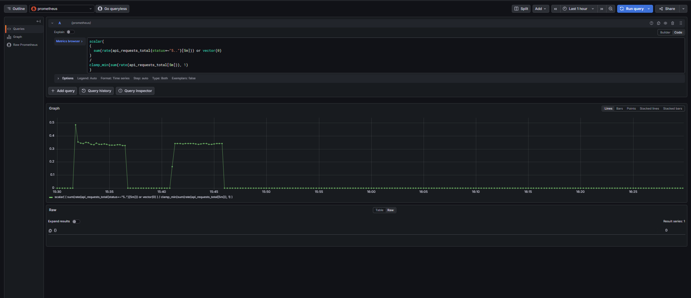
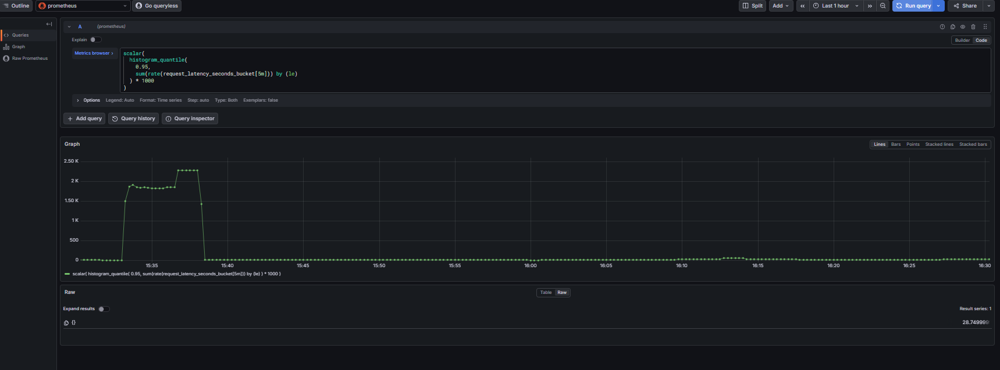

# Incident Management System (IMS)

A production-inspired **SRE-grade Incident Management System** designed to ingest high-volume signals, intelligently group them into incidents, monitor system health, and trigger alerts based on real-time metrics.

---

# Overview

This system simulates a real-world SRE platform similar to **PagerDuty / Datadog / New Relic**.

It is designed to:

* Handle high-volume signals (burst traffic)
* Reduce alert noise via debouncing
* Track incident lifecycle
* Enforce RCA before closure
* Provide real-time dashboards
* Monitor system health using Prometheus
* Trigger alerts using Grafana

---

# Architecture

```
        +----------------------+
        |   Signal Producer    |
        +----------+-----------+
                   |
                   v
        +----------------------+
        |   FastAPI Backend    |
        +----------+-----------+
                   |
                   v
        +----------------------+
        |   Redis Queue        |
        +----------+-----------+
                   |
                   v
        +----------------------+
        |   Worker Process     |
        +----------+-----------+
                   |
                   v
        +----------------------+
        |   PostgreSQL DB      |
        +----------+-----------+
                   |
                   v
        +----------------------+
        |   React Dashboard    |
        +----------------------+

        -------- Observability Layer --------

        +----------------------+
        |   Prometheus         |
        +----------+-----------+
                   |
                   v
        +----------------------+
        |   Grafana            |
        +----------+-----------+
                   |
                   v
        +----------------------+
        |   Email Alerts       |
        +----------------------++
```

---

# Tech Stack

| Layer            | Technology          |
| ---------------- | ------------------- |
| Backend          | FastAPI             |
| Queue            | Redis               |
| Worker           | Python Async Worker |
| Database         | PostgreSQL          |
| Frontend         | React               |
| Monitoring       | Prometheus          |
| Alerting         | Grafana             |
| Containerization | Docker              |

---

# Core Features

## 1. Async Signal Processing

* Signals pushed to Redis queue
* Worker processes asynchronously
* Prevents API overload

---

## 2. Debouncing (Noise Reduction)

* Signals within 10 seconds grouped into 1 incident
* Implemented using Redis TTL

---

## 3. Incident Lifecycle

```
OPEN → INVESTIGATING → RESOLVED → CLOSED
```

* Enforced transitions
* Prevents invalid state changes

---

## 4. Mandatory RCA Validation

* Cannot close incident without RCA
* Ensures accountability

---

## 5. MTTR Calculation

```
MTTR = resolved_at - created_at
```

* Automatically computed
* Visible in dashboard

---

## 6. Rate Limiting

* Prevents API abuse
* Basic per-IP throttling

---

## 7. Backpressure Handling

```
High Load → Redis Queue → Worker → DB
```

* Queue absorbs bursts
* System remains stable under load

---

# Observability & Monitoring

## Metrics exposed:

* `api_requests_total`
* Request rate (RPS)
* Error rate (5xx)
* Request latency (histogram)

---

## Grafana Dashboard Panels

* Total Signals
* API Throughput (RPS)
* Queue Depth
* Signal Ingestion Rate
* Error Rate (%)
* P95 Latency
* Requests by Endpoint

---

# Alerting (Grafana)

## 1. High Error Rate Alert

**Condition:**

```
Error Rate > 5%
```

**Meaning:**

* Backend instability
* API failures

---

## 2. High Latency Alert (P95)

**Condition:**

```
P95 Latency > 500 ms
```

**Meaning:**

* Performance degradation
* Slow responses

---

## Notification System

* Email alerts configured via SMTP
* Real-time alert delivery
* Includes:

  * Alert name
  * Severity
  * Metrics value
  * Labels

---

# Data Model

## Incident

* id
* component
* status
* created_at
* resolved_at

## Signal

* id
* component
* error
* incident_id

## RCA

* incident_id
* root_cause
* fix

---

# Setup Instructions

## 1. Clone Repo

```bash
git clone https://github.com/nirmalyavishal96-hash/sre-incident-system.git
cd sre-incident-system
```

---

## 2. Start Full System (Recommended)

```bash
docker compose up -d
```

---

## 3. Access Services

| Service    | URL                   |
| ---------- | --------------------- |
| Backend    | http://localhost:8000 |
| Prometheus | http://localhost:9090 |
| Grafana    | http://localhost:3001 |

---

# Testing the System

## Send normal traffic

```bash
for i in {1..50}; do curl -s http://localhost:8000/metrics > /dev/null; done
```

---

## Simulate Errors (Trigger Alert)

```bash
for i in {1..50}; do curl -s http://localhost:8000/error > /dev/null; done
```

---

## Verify Metrics

```bash
curl http://localhost:8000/metrics | grep api_requests_total
```

---

# Example Alert Flow

```
User traffic → Metrics increase → Prometheus scrapes → Grafana evaluates → Alert fires → Email sent
```

---

# System Design Highlights

* Decoupled architecture (API vs Worker)
* Queue-based backpressure handling
* Real-time observability
* Alert-driven monitoring
* Production-like failure simulation
* Designed following SRE principles (SLI, SLO, alerting thresholds)

---

# Future Enhancements

* Auto-healing (restart services on alert)
* Slack / PagerDuty integration
* Distributed tracing (Jaeger)
* Kubernetes deployment
* Advanced alert routing

---

<<<<<<< HEAD
- Backend
- Frontend
- Docker setup
- README

## Dashboard Preview
=======
# Screenshots
>>>>>>> aebc7a5 (obserbility and alerting addded)

### System Dashboard 


### Alert Triggered


<<<<<<< HEAD
- This project was developed using iterative planning and system design prompts.
- Design decisions, architecture, and implementation steps were documented during development.
## Project Structure
=======
### Email Notification

>>>>>>> aebc7a5 (obserbility and alerting addded)

### Metrics Endpoint


### Grafana Dashboard


### Error Rate (PromQL)
Calculates percentage of failed requests over total requests (5xx errors)


### P95 Latency (PromQL)
Tracks 95th percentile latency to detect slow responses




---

# Project Structure

```
backend/
  app/
frontend/
screenshot/
docker-compose.yml
README.md
```

---
# Version Upgrade (v2)

This project was enhanced after initial submission with production-grade observability and alerting features.

## Added in v2:

- Prometheus integration for metrics scraping
- Grafana dashboards for real-time monitoring
- Alerting system (Error Rate & Latency)
- Email notifications using SMTP
- Failure simulation endpoints (/error)
- P95 latency tracking

## Why this matters:

These upgrades transform the system from a backend project into a **complete SRE monitoring system**, demonstrating real-world production practices.

# Key Learning Outcomes

- Implemented real-time monitoring using Prometheus
- Designed alerting based on error rate and latency (SLO-driven)
- Built scalable async architecture using Redis queue
- Simulated production failures and validated alerting system

# Author 
**Nirmalya Das**


