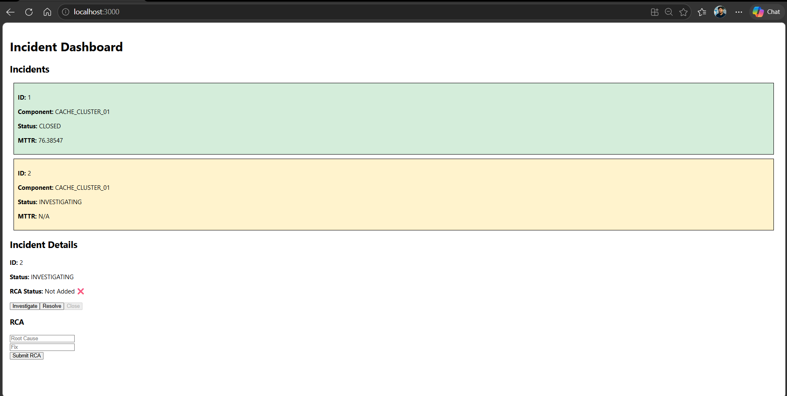
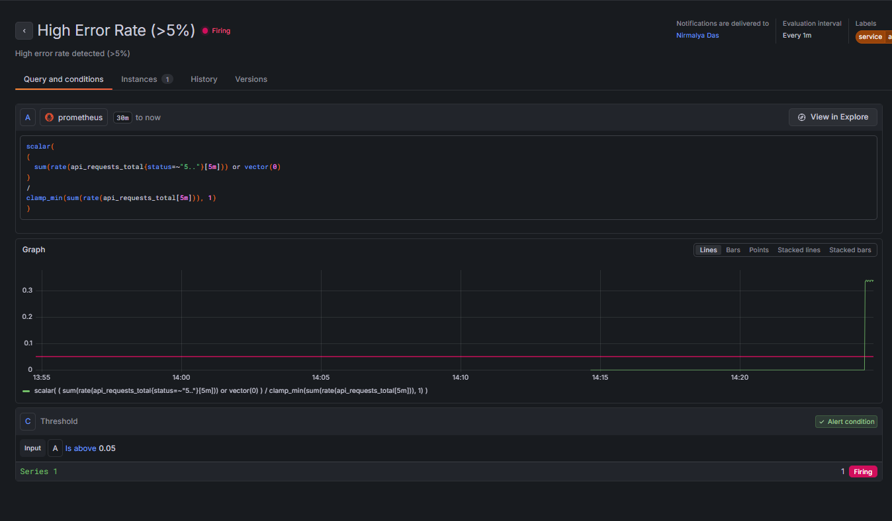
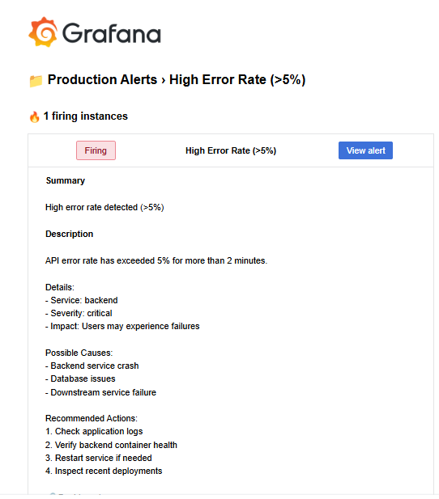
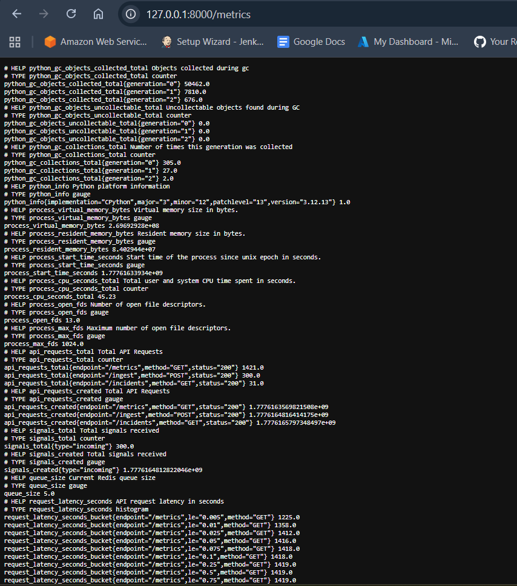
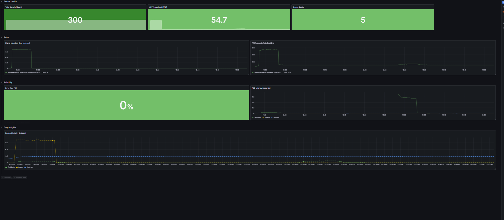

# Incident Management System (IMS)

A **production-inspired SRE system** designed to ingest high-volume signals, reduce alert noise, track incidents, and provide real-time observability with automated alerting.

---

# Why This Project Matters

In real-world distributed systems, failures are constant — but **noise is the real problem**.

This project focuses on:

* Detecting anomalies in real-time
* Reducing alert fatigue via intelligent signal grouping
* Tracking incidents with accountability (RCA enforcement)
* Monitoring system health using industry-standard tools

It simulates how modern SRE teams operate in production environments.

---

# Architecture Overview

```
        +----------------------+
        |   Signal Producer    |
        +----------+-----------+
                   |
                   v
        +----------------------+
        |   FastAPI Backend    |
        +----------+-----------+
                   |
                   v
        +----------------------+
        |   Redis Queue        |  ← Backpressure Buffer
        +----------+-----------+
                   |
                   v
        +----------------------+
        |   Async Worker       |
        +----------+-----------+
                   |
                   v
        +----------------------+
        |   PostgreSQL         |
        +----------+-----------+
                   |
                   v
        +----------------------+
        |   React Dashboard    |
        +----------------------+

        -------- Observability Layer --------

        Prometheus → Grafana → Alerts → Email
```

---

# Tech Stack

| Layer            | Technology   |
| ---------------- | ------------ |
| Backend          | FastAPI      |
| Queue            | Redis        |
| Worker           | Python Async |
| Database         | PostgreSQL   |
| Frontend         | React        |
| Monitoring       | Prometheus   |
| Alerting         | Grafana      |
| Containerization | Docker       |

---

# Core Features

## 1. Async Signal Processing

* Signals are ingested via API
* Buffered in Redis queue
* Processed asynchronously by workers

Ensures system remains responsive under load

---

## 2. Intelligent Signal Grouping (Debouncing)

* Signals for the same component are grouped into active incidents
* Prevents duplicate incident creation
* Reduces alert noise significantly

Implemented using state-aware incident matching

---

## 3. Incident Lifecycle Management

```
OPEN → INVESTIGATING → RESOLVED → CLOSED
```

* Strict transition validation enforced
* Prevents invalid or out-of-order transitions
* Reflects real-world SRE workflows

---

## 4. Mandatory RCA Enforcement

* Incident cannot be closed without RCA
* Prevents incomplete incident resolution
* Ensures accountability and learning

---

## 5. MTTR Calculation

```
MTTR = resolved_at - created_at
```

* Automatically computed when incident is resolved
* Helps measure system reliability

---

## 6. Severity-Based Classification

* Supports severity levels (P0, P1, P2)
* Enables prioritization of incidents
* Aligns with real-world alerting strategies

---

## 7. Rate Limiting

* Basic per-IP throttling
* Prevents API abuse and cascading failures

---

## 8. Backpressure Handling

* Redis acts as a buffer between API and DB
* Worker processes at controlled rate
* Prevents database overload

---

## 9. Logging & Operational Visibility

* Logs incident lifecycle transitions
* Logs RCA creation events
* Logs worker behavior (creation vs reuse)

Enables debugging and system observability

---

# Observability & Monitoring

## Metrics Exposed

* `api_requests_total`
* Request rate (RPS)
* Error rate (5xx)
* Request latency (histogram)

---

## Grafana Dashboards

* API Throughput
* Error Rate (%)
* P95 Latency
* Queue Depth
* Endpoint Traffic

---

#  Alerting Strategy

## High Error Rate

```
Error Rate > 5%
```

Indicates backend instability

---

## High Latency (P95)

```
P95 Latency > 500ms
```

Indicates performance degradation

---

## Notification

* Email alerts via SMTP
* Includes severity, labels, and metrics

---

# Incident Flow

1. Signal received via API
2. Stored in Redis queue
3. Worker processes signal
4. Signals grouped into active incident
5. Metrics updated
6. Prometheus scrapes metrics
7. Grafana evaluates conditions
8. Alert triggered → Email sent
9. RCA added → Incident closed

---

# API Endpoints

| Method | Endpoint               | Description            |
| ------ | ---------------------- | ---------------------- |
| POST   | /ingest                | Ingest signal          |
| GET    | /incidents             | List incidents         |
| PUT    | /incidents/{id}/status | Update incident status |
| POST   | /incidents/{id}/rca    | Add RCA                |
| GET    | /health                | Health check           |
| GET    | /metrics               | Prometheus metrics     |

---

# Failure Simulation

Simulate system failures:

```bash
curl http://localhost:8000/error
```

Used to validate alerting pipeline

---

# Scalability Considerations

* Redis queue handles burst traffic
* Async workers enable parallel processing
* System supports horizontal scaling

**Future Improvement:**

* Kafka / PubSub for 10k+ signals/sec

---

# Design Tradeoffs

* Redis vs Kafka → simplicity vs scalability
* Prometheus vs Cloud Monitoring → flexibility vs managed solution
* Email alerts vs PagerDuty → demo vs production-grade alerting

---

# Limitations

* No distributed tracing
* No auto-healing yet
* Limited alert routing (email only)
* Not optimized for extreme scale (10k+/sec)

---

# Future Enhancements

* Auto-healing using Kubernetes
* PagerDuty / Slack integration
* Distributed tracing (Jaeger)
* GKE deployment
* Advanced anomaly detection

---

# Setup Instructions

```bash
git clone https://github.com/nirmalyavishal96-hash/sre-incident-system.git
cd sre-incident-system
docker compose up -d
```

---

# Access Services

| Service    | URL                   |
| ---------- | --------------------- |
| Backend    | http://localhost:8000 |
| Prometheus | http://localhost:9090 |
| Grafana    | http://localhost:3001 |

---
### System Dashboard


### Alert Triggered


### Email Notification


### Metrics Endpoint


### Grafana Dashboard


# Key SRE Concepts Demonstrated

* Observability (metrics + dashboards)
* Alerting based on thresholds
* Incident lifecycle enforcement
* MTTR tracking
* Backpressure handling
* Event-driven architecture
* Failure simulation

---

# Author

**Nirmalya Das**
DevOps / SRE Enthusiast
